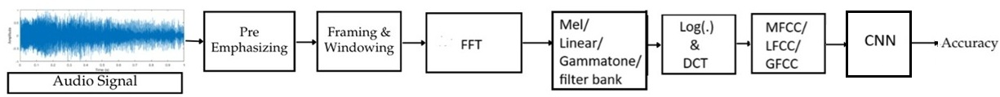

# Infant Cry Classification using cepstral features: MFCC, LFCC, GFCC

Dataset used: Baby Chillanto 2 
DL Classifier: CNN

**Mel Frequency Cepstral Coefficients (MFCC)**: MFCC is used to replicate human auditory perception by applying the Mel scale, which is non-linearly spaced—denser at lower frequencies and more spread out at higher frequencies. It extracts vocal tract characteristics by applying a logarithmic filterbank, emphasizing speech phonetics over pitch information.
 
 
**Linear Frequency Cepstral Coefficients (LFCC)**: LFCC utilizes linearly spaced filters instead of the Mel scale, ensuring equal emphasis on both low- and high-frequency components. It captures detailed spectral information based on raw signal characteristics rather than human auditory perception, making it especially beneficial for pathology detection in infant cry abnormalities. Additionally, LFCC is less affected by nonlinear distortions in speech, allowing it to effectively analyze subtle spectral variations, which is crucial for medical and diagnostic applications.
 
 
**Gammatone Frequency Cepstral Coefficients (GFCC)**: GFCC employs gammatone filterbanks that mimic the human cochlear response, allowing it to capture both formant and pitch information. It is particularly robust to noise, making it highly effective for speech enhancement, speaker recognition etc. GFCC excels at identifying fine-grained spectral details, especially in noisy environments, making it a valuable feature extraction method for challenging acoustic conditions.

