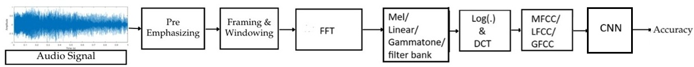

# Infant Cry Classification using cepstral features: MFCC, LFCC, GFCC

Dataset used: **Baby Chillanto 2, a property of the Instituto Nacional de Astrofisica Optica y Electronica – CONACYT, Mexico**, the latest infant cry classification dataset, chosen for its extensive collection of labeled infant cry samples covering multiple health conditions. Unlike older datasets, Baby Chillanto 2 provides a diverse range of cry types, making it ideal for training robust classification models. This dataset is particularly significant due to its up-to-date cry patterns, diverse categories—including both normal and pathological cries—and real-world applicability in early diagnosis of infant health conditions. It consists of eight classes: **normal, deaf, hunger, shower, asphyxia, hyperbilirubinemia, hypothyroidism, and pain**, each representing a distinct infant cry condition. The dataset is organized into subfolders, each containing `.wav` files corresponding to a specific class. These raw audio files are sampled at 16 kHz, varying in length to reflect real-world variability in cry duration and intensity.  
Binary (2-class) classification: 
Normal Class = normal, hunger, shower, pain 
Pathological Class = deaf, asphyxia, hyperbilirubinemia, hypothyroidism  
Link: https://drive.google.com/file/d/1mPJ5NLhmJd8BxRI3g4C2tcHqWOqM2TJn/view?usp=sharing  
DL Classifier: CNN

**Mel Frequency Cepstral Coefficients (MFCC)**: MFCC is used to replicate human auditory perception by applying the Mel scale, which is non-linearly spaced—denser at lower frequencies and more spread out at higher frequencies. It extracts vocal tract characteristics by applying a logarithmic filterbank, emphasizing speech phonetics over pitch information.
 
 
**Linear Frequency Cepstral Coefficients (LFCC)**: LFCC utilizes linearly spaced filters instead of the Mel scale, ensuring equal emphasis on both low- and high-frequency components. It captures detailed spectral information based on raw signal characteristics rather than human auditory perception, making it especially beneficial for pathology detection in infant cry abnormalities. Additionally, LFCC is less affected by nonlinear distortions in speech, allowing it to effectively analyze subtle spectral variations, which is crucial for medical and diagnostic applications.
 
 
**Gammatone Frequency Cepstral Coefficients (GFCC)**: GFCC employs gammatone filterbanks that mimic the human cochlear response, allowing it to capture both formant and pitch information. It is particularly robust to noise, making it highly effective for speech enhancement, speaker recognition etc. GFCC excels at identifying fine-grained spectral details, especially in noisy environments, making it a valuable feature extraction method for challenging acoustic conditions.

**NOTE**: The dataset consists of .wav files which have undergone audio segmentation of 2 seconds to increase the size of the dataset for better analysis. 
The cepstral features are extracted from the repository: [Click Here](https://github.com/V1shnu127/Cepstral_delta_double-delta_feature_extraction)  
Audio Data Segmentation of the dataset: [Click Here](https://raw.githubusercontent.com/V1shnu127/Audio-Data-Segmentation/refs/heads/main/audio_data_SEGMENT.py)  
 

**Functional Block Diagram of the Project**
